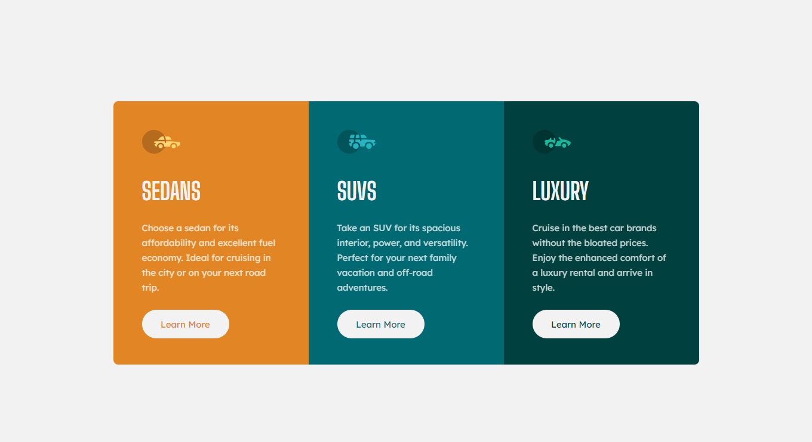

# Frontend Mentor Challenge: 3-column preview card component solution

## Table of contents

- [Overview](#overview)
  - [The challenge](#the-challenge)
  - [Screenshot](#screenshot)
  - [Links](#links)
- [My process](#my-process)
  - [Built with](#built-with)
  - [What I learned](#what-i-learned)
  - [Continued development](#continued-development)

## Overview

### The challenge

Users should be able to:

- View the optimal layout depending on their device's screen size (mobile / desktop)
- See hover states for interactive elements

### Screenshot



### Links

- Solution URL: [Frontend Mentor Challenge](https://www.frontendmentor.io/challenges/3column-preview-card-component-pH92eAR2-)
- Live Site URL: [My Solution](https://ntwiler.github.io/Responsive-3-Column-Preview-Card/)

## My process

### Built with

- Semantic HTML5 markup
- CSS custom properties and variables
- Flexbox for responsive layout
- Mobile-first workflow

### What I learned

It was a good exercise to practice the planning phase configuring the information and variables to be used in the project, understanding the patterns that will repeat themselves.

Also, I was able to working with the mobile-first workflow, that help me to understanding better this methodology and yours advantages.

And in order to develop a cleaner code, I treid to use the idea above so it wasn´t needed to repeat all the values of the button in the css: "also did it with the rectangles background"

```html
<button class="button-box nav-orange">Learn More</button>
<button class="button-box nav-blue">Learn More</button>
<button class="button-box nav-green">Learn More</button>
```

```css
.button-box {
  background-color: var(--color-soft-white);
  width: 146px;
  height: 48px;
  flex-shrink: 0;
  border-radius: 25px;
  margin-top: 25px;
  margin-left: 48px;
  font: 400 15px "Lexend Deca", sans-serif;
  border: 2px solid var(--color-soft-white);
}

.button-box.nav-orange {
  color: var(--color-orange);
}
.button-box.nav-blue {
  color: var(--color-nav-blue);
}

.button-box.nav-green {
  color: var(--color-nav-green);
}
```

### Continued development

I´ll still looking for ideas that can make my code cleaner, studying the mobile-first methodology and other tools like Sass for future projects
